# 🎮 GameStore API

RESTful API for managing a game store, built with ASP.NET Core using modern development practices.

[](https://dotnet.microsoft.com/)
[](https://www.postgresql.org/)
[](https://redis.io/)
[](https://www.docker.com/)
[](LICENSE)

## 📋 Overview

GameStore API is a full-featured backend for a game store with support for:
- Games and genres management
- Reviews and ratings system
- JWT authentication with roles
- Redis caching
- Pagination, filtering, and sorting

## ✨ Features

### 🔐 Authentication & Authorization
- JWT tokens with configurable expiration
- Role-based access control (Admin, User)
- Endpoint protection via policies
- Secure password storage (BCrypt)

### 🎮 Game Management
- CRUD operations for games
- Pagination with metadata
- Sorting by price, name, release date
- Filtering by genre and price
- Search by name

### 💬 Reviews System
- Create reviews with ratings (1-5)
- Edit and delete own reviews
- Duplicate review prevention
- Data validation

### ⚡ Caching
- Redis for fast data access
- Graceful degradation when Redis is unavailable
- Automatic cache invalidation
- Configurable cache TTL

### 🐳 Containerization
- Docker Compose for all services
- Automatic migration application
- Health checks for PostgreSQL
- Environment variables via `.env`

## 🛠 Tech Stack

| Technology | Version | Purpose |
|------------|---------|---------|
| **ASP.NET Core** | 10.0 | Web API framework |
| **Entity Framework Core** | 10.0 | ORM for database operations |
| **PostgreSQL** | 16 | Relational database |
| **Redis** | 7 | In-memory cache |
| **JWT** | - | Authentication |
| **BCrypt** | - | Password hashing |
| **Docker** | - | Containerization |
| **Scalar** | - | API documentation |

## 🏗 Architecture

```mermaid
graph LR
    Client["🖥️ Client"] --> API["ASP.NET Core Web API"]
    
    subgraph API["ASP.NET Core Web API"]
        direction TB
        
        subgraph Middleware["Middleware Pipeline"]
            direction LR
            Auth[" Authentication"] --> AuthZ["👤 Authorization"] --> CORS["🌐 CORS"]
        end
        
        subgraph Endpoints["Endpoints"]
            direction TB
            AuthEP[" AuthEndpoints"]
            GamesEP["🎮 GamesEndpoints"]
            GenresEP["🏷️ GenresEndpoints"]
            ReviewsEP["💬 ReviewsEndpoints"]
        end
        
        subgraph Services["Services"]
            Cache["⚡ CacheService"]
        end
    end
    
    API --> DB[("🗄️ PostgreSQL")]
    API --> Redis[("🔴 Redis Cache")]
    
    Middleware --> Endpoints
    Endpoints --> Services
    Services --> DB
    Services --> Redis
    
    style API fill:#2d2d2d,stroke:#4a9eff,stroke-width:2px
    style Middleware fill:#3d3d3d,stroke:#4a9eff
    style Endpoints fill:#3d3d3d,stroke:#4a9eff
    style Services fill:#3d3d3d,stroke:#4a9eff
    style DB fill:#336791,stroke:#fff,color:#fff
    style Redis fill:#dc382d,stroke:#fff,color:#fff
    style Client fill:#4a9eff,stroke:#fff,color:#fff
```


## 🚀 Quick Start

### Prerequisites

- [Docker](https://www.docker.com/get-started) and Docker Compose
- [Git](https://git-scm.com/)

### Installation & Running

1. **Clone the repository**
    ```bash
    git clone https://github.com/nokinsddd/GameStore.Api.git
    cd GameStore.Api
    ```
2. **Create .env file based on .env.example**
    ```bash
    cp .env.example .env
    ```
3. **Edit .env and set your values:**
    ```env
    POSTGRES_USER=YourUserName
    POSTGRES_PASSWORD=YourSecretPassword
    POSTGRES_DB=YourDbName
    PGADMIN_DEFAULT_EMAIL=admin@admin.com
    PGADMIN_DEFAULT_PASSWORD=YourSuperSecretAdmin123!

    JWT_SECRET_KEY=YourVeryLongSuperSecretKeyForJwtTokenGeneration
    JWT_ISSUER=GameStoreApi
    JWT_AUDIENCE=GameStoreClient
    JWT_EXPIRE_MINUTES=60
    ```
4. **Start containers**
    ```bash
    docker-compose up -d
    ```
5. **Check status**
    ```bash
    docker-compose ps
    ```
| Service | Url | Description |
|-------------|-------------|-------------|
| API | http://localhost:5000 | Main API |
| Scalar Docs | http://localhost:5000/scalar | Interactive documentation |
|   pgAdmin   | http://localhost:5050 | PostgreSQL web interface |
|  PostgreSQL | localhost:5433 | Database (external port) |
| Redis | localhost:6379 | Cache (external port) |
## 📚 API Endpoints
### 🔐 Authentication
    ```http
    POST /auth/register
    Content-Type: application/json

    {
    "username": "admin",
    "password": "SuperSecret123!"
    }

    POST /auth/login
    Content-Type: application/json

    {
    "username": "admin",
    "password": "SuperSecret123!"
    }

    POST /auth/make-admin
    Content-Type: application/json

    {
    "username": "admin"
    }
    ```
### 🎮 Games
    ```http
    # Get games list (with pagination, filtering, sorting)
    GET /games?pageNumber=1&pageSize=10&sortBy=price&sortOrder=desc&genreId=1&minPrice=10&maxPrice=100&search=witcher

    # Get game by ID
    GET /games/{id}

    # Create game (requires authentication)
    POST /games
    Authorization: Bearer {token}
    Content-Type: application/json

    {
    "name": "The Witcher 3",
    "genreId": 1,
    "price": 39.99,
    "releaseDate": "2015-05-19"
    }

    # Update game (Admin only)
    PUT /games/{id}
    Authorization: Bearer {admin_token}
    Content-Type: application/json

    {
    "name": "The Witcher 3: Wild Hunt",
    "genreId": 1,
    "price": 29.99,
    "releaseDate": "2015-05-19"
    }

    # Delete game (Admin only)
    DELETE /games/{id}
    Authorization: Bearer {admin_token}
    ```
### 🏷 Genres
    ```http
    # Get all genres (requires authentication)
    GET /genres
    Authorization: Bearer {token}

    # Create genre (requires authentication)
    POST /genres
    Authorization: Bearer {token}
    Content-Type: application/json

    {
    "name": "RPG"
    }
    ```
### 💬 Reviews
    ```http
    # Get reviews for a game
    GET /games/{gameId}/reviews

    # Create review (requires authentication)
    POST /games/{gameId}/reviews
    Authorization: Bearer {token}
    Content-Type: application/json

    {
    "rating": 5,
    "comment": "Amazing game, graphics are super!"
    }

    # Update review (author only)
    PUT /games/{gameId}/reviews/{reviewId}
    Authorization: Bearer {token}
    Content-Type: application/json

    {
    "rating": 4,
    "comment": "Updated review"
    }

    # Delete review (author only)
    DELETE /games/{gameId}/reviews/{reviewId}
    Authorization: Bearer {token}
    ```
## ⚙️ Configuration
### Environment Variables
All secrets are stored in .env file (not committed to Git):
| Variable | Description | Example |
|-------------|-------------|-------------|
| POSTGRES_USER | PostgreSQL user | postgres |
| POSTGRES_DB | Database name | gamestore |
| PGADMIN_DEFAULT_EMAIL | pgAdmin email | admin@example.com |
| PGADMIN_DEFAULT_PASSWORD | pgAdmin password | Admin123! |
| JWT_SECRET_KEY | JWT secret key (min. 32 chars) | VeryLongSecretKey... |
| JWT_ISSUER | JWT token issuer | GameStoreApi |
| JWT_AUDIENCE | JWT token audience | GameStoreClient |
| JWT_EXPIRE_MINUTES | Token lifetime (minutes) | 60 |
### Project Structure
    ```
        GameStore.Api/
    ├── Data/
    │   ├── GameStoreContext.cs      # DbContext
    │   └── DataExtensions.cs        # Extension methods
    ├── Models/
    │   ├── Game.cs                  # Game model
    │   ├── Genre.cs                 # Genre model
    │   ├── Review.cs                # Review model
    │   └── User.cs                  # User model
    ├── DTOs/
    │   ├── GameDtos.cs              # Game DTOs
    │   ├── GenreDto.cs              # Genre DTOs
    │   ├── ReviewDtos.cs            # Review DTOs
    │   └── GetGamesRequest.cs       # Request DTOs
    ├── EndPoints/
    │   ├── AuthEndpoints.cs         # Authentication endpoints
    │   ├── GamesEndpoints.cs        # Games endpoints
    │   ├── GenresEndpoints.cs       # Genres endpoints
    │   └── ReviewsEndpoints.cs      # Reviews endpoints
    ├── Services/
    │   └── CacheService.cs          # Caching service
    ├── Migrations/                  # EF Core migrations
    ├── Program.cs                   # Entry point
    ├── docker-compose.yml           # Docker configuration
    ├── Dockerfile                   # API Dockerfile
    ├── .env.example                 # Environment variables example
    └── .gitignore                   # Ignored files
    ```
## 🧪 Testing
### API Testing
Use .http file or tools like Postman/Insomnia:
    ```http
    ### Register
    POST http://localhost:5000/auth/register
    Content-Type: application/json

    {
    "username": "testuser",
    "password": "Test123!"
    }

    ### Login
    POST http://localhost:5000/auth/login
    Content-Type: application/json

    {
    "username": "testuser",
    "password": "Test123!"
    }

    ### Get games with caching
    GET http://localhost:5000/games?pageNumber=1&pageSize=10
    ```
### Cache Testing
    ```bash
    # First request (cache miss)
    curl -w "\nTime: %{time_total}s\n" http://localhost:5000/genres

    # Second request (cache hit - faster)
    curl -w "\nTime: %{time_total}s\n" http://localhost:5000/genres

    # View keys in Redis
    docker exec -it gamestore-redis redis-cli KEYS "*"
    ```
## 📊 Performance
### Caching Results
| Request | Without Cache | With Cache | Speedup |
|-------------|-------------|-------------|-------------|
| GET /genres | ~50ms | ~3ms | 16x |
| GET /games | ~100ms | ~10ms | 10x |
| GET /games/{id} | ~30ms | ~2ms | 15x |
## 📈 Roadmap
- Unit tests with >80% coverage
- Refresh tokens for enhanced security
- Rate limiting for DDoS protection
- Health checks for monitoring
- Image uploads for games
- Wishlist / Favorites